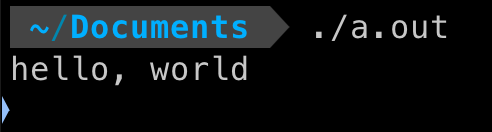
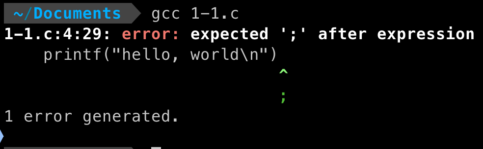
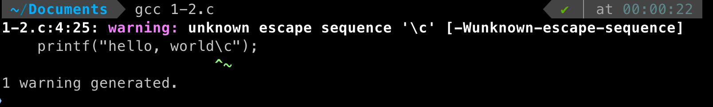
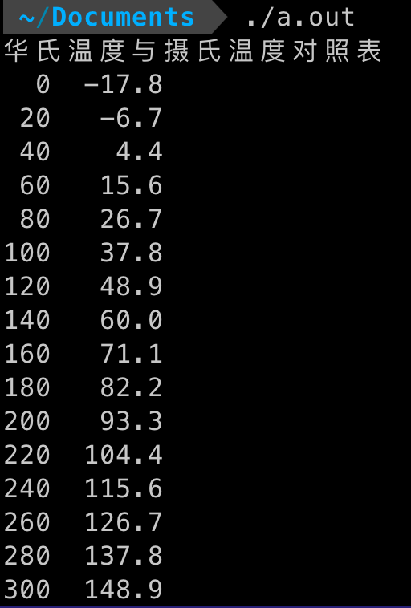
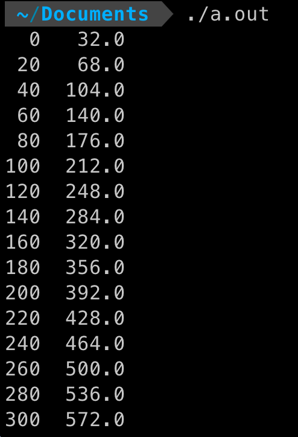

# 1-1

Q：在你自己的系统中运行”hello, world“程序。再有意去掉程序中的部分内容，看看会得到什么出错信息。

A：
```c
#include <stdio.h>

int main() {
    printf("hello, world\n");
    return 0;
}
```
编译程序
```
gcc 1-1.c
```


```c
#include <stdio.h>

int main() {
    printf("hello, world\n")
    return 0;
}
```
重新编译程序
```
gcc 1-1.c
```


# 1-2
Q：做个实验，当printf函数的参数字符串中包含\c（其中c是上面的转义字符序列中未曾列出的某个字符）时，观察一下会出现什么情况。

A：
```c
#include <stdio.h>

int main() {
    printf("hello, world\c");
    return 0;
}
```
编译程序
```
gcc 1-2.c
```


# 1-3

Q：修改温度转换程序，使之能在转换表的顶部打印一个标题。

A：
```c
#include <stdio.h>

int main() {
    float fahr, celsius;
    int lower = 0, upper = 300, step = 20;
    fahr = lower;
    printf("华氏温度与摄氏温度对照表\n");
    while (fahr <= upper) {
        celsius = (5.0 / 9.0) * (fahr - 32.0);
        printf("%3.0f %6.1f\n", fahr, celsius);
        fahr = fahr + step;
    }
}

```
编译程序
```
gcc 1-3.c
```


# 1-4

Q：编写一个程序打印摄氏温度转换为相应的华氏温度的转换表。

A:
```c
#include <stdio.h>

int main() {
    float fahr, celsius;
    int lower = 0, upper = 300, step = 20;
    celsius = lower;
    while (celsius <= upper) {
        fahr = celsius / (5.0 / 9.0) + 32.0;
        printf("%3.0f %6.1f\n", celsius, fahr);
        celsius = celsius + step;
    }
}
```
