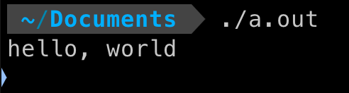
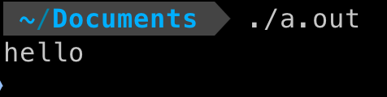

# 1-1
Q：在你自己的系统中运行”hello, world“程序。再有意去掉程序中的部分内容，看看会得到什么出错信息。

A：
```c
#include <stdio.h>

int main() {
    printf("hello, world\n");
    return 0;
}
```
编译程序
```
gcc 1-1.c
```


```c
#include <stdio.h>

int main() {
    printf("hello, world\n")
    return 0;
}
```
重新编译程序
```
gcc 1-1.c
```


# 1-2
Q：做个实验，当printf函数的参数字符串中包含\c（其中c是上面的转义字符序列中未曾列出的某个字符）时，观察一下会出现什么情况。

A：
```c
#include <stdio.h>

int main() {
    printf("hello, world\c");
    return 0;
}
```
编译程序
```
gcc 1-2.c
```
