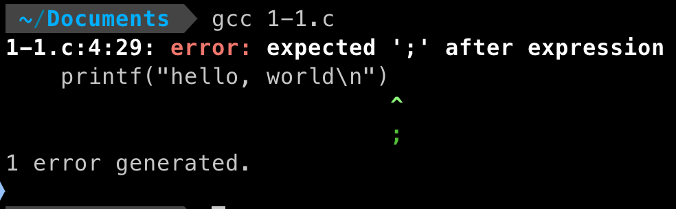

# 1-1
Q：在你自己的系统中运行”hello, world“程序。再有意去掉程序中的部分内容，看看会得到什么出错信息。
A：
```
#include <stdio.h>

int main() {
    printf("hello, world\n");
    return 0;
}
```
编译程序
```
gcc 1-1.c
```


```
#include <stdio.h>

int main() {
    printf("hello\n");
    return 0;
}
```
重新编译程序
```
gcc 1-1.c
```
